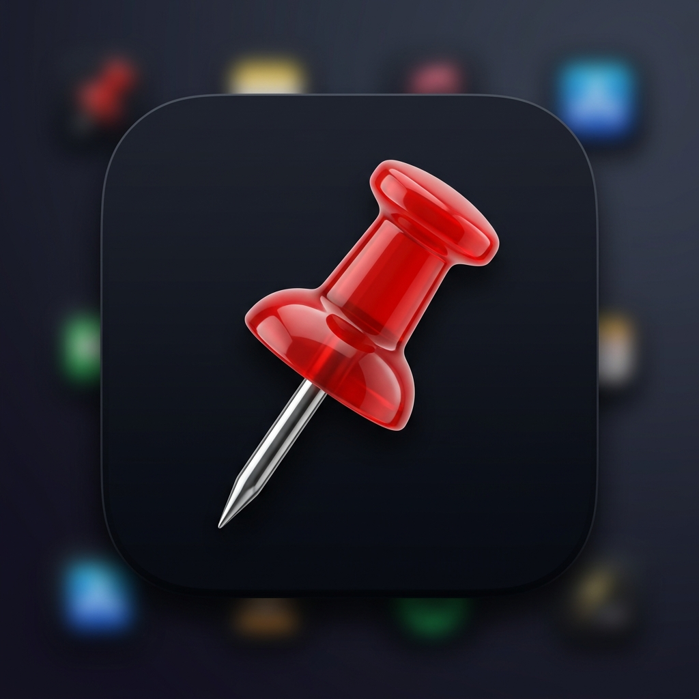
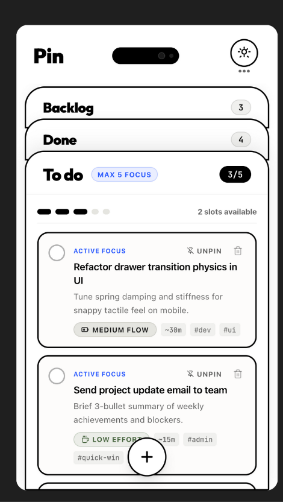

# <p align="center"><br>Pin</p>

<p align="center">
  <strong>A minimalist, high-focus companion Kanban app built for Linux Desktop & Wear OS Smartwatches.</strong>
</p>

<p align="center">
  
  
  
  
  
  
</p>

---

## 📌 Overview

**Pin** is a companion Kanban application tailored for power users, developers, and writers on Linux desktop environments (such as GNOME) as well as **Wear OS smartwatches**.

On desktop, designed to sit snugly alongside your IDE, terminal, or web browser, **Pin** adopts a **companion layout** (fixed 430px width, height-only resizing, and full monitor workarea default height) so you never lose context while organizing your workload.

On smartwatches, **Pin** seamlessly adapts into a lightweight, tactile wrist companion with gesture-safe navigation, OLED-optimized contrast, full-width task cards, and cloud synchronization.



---

## ✨ Features

- **🗂️ Layered Deck Kanban**:
  - Three intuitive, full-width drawers: **Backlog**, **In Progress**, and **Done**.
  - One-click toggling and seamless animated transitions between layers.
- **⌚ Wear OS Smartwatch Companion**:
  - **Auto Viewport Adaptation**: Automatically identifies circular and wearable viewports via `WearableUtils.isWearable(context)` and activates `WearableHomePage`.
  - **Left-Only Infinite Carousel Navigation**: Custom `LeftOnlyPageScrollPhysics` ensures navigation only swipes left forward (`Today -> Backlog -> Completed -> Account -> Today...`), completely avoiding interference with the Wear OS left-edge swipe-to-dismiss system gesture.
  - **Full-Width Multi-Line Task Cards**: Expands cards to edge-to-edge width with 2-line title and 3-line description rendering so you can read your pins at a glance on the go.
  - **Wearable Focus Mode**: Immersive single-pin focus view with elapsed timer, step-by-step checklist, and instant completion.
  - **Watch Cloud Sync & Account**: Dedicated watch Account screen with 1-click Google Sign-In, Email/Password sign-in, case-insensitive credential normalization, and auto password prompting.
- **⚡ Atomic Steps & Task Breakdown**:
  - Decompose large cards into actionable, bite-sized micro-steps.
  - Interactive checklists with real-time completion progress indicators.
- **🎯 Focus Mode**:
  - Single-task immersion view designed to eliminate visual clutter.
  - Integrated timer, step-by-step checklist, and one-tap task completion.
- **🎨 System Theme Integration**:
  - Automatically matches system dark or light theme preferences via real-time GNOME / system observer.
  - Manual override toggle available in the header menu.
- **🪟 Custom Frameless Window**:
  - Frameless, modern interface without bulky OS title bars.
  - Custom draggable header bar for effortless positioning.
  - Vertical-only edge resizing locked to companion width (430px).
- **🔥 Firebase Offline-First Dual-Layer Synchronization**:
  - **Zero-Latency Optimistic UI**: UI updates immediately via Riverpod state (0ms latency).
  - **Guaranteed Local Persistence**: Instant writes to local storage (`PrefsStorageAdapter`) on every single change ensure zero offline data loss, even in guest mode.
  - **1,000ms Debounced Cloud Firestore Sync**: When signed in, rapid edits or checklist toggles debounce for 1,000ms before sending a single compact snapshot to `/users/{userId}/meta/board`, preventing write thrashing and API quota exhaustion.
  - **Multi-Device Cloud Hydration**: Logging in automatically hydrates your board from the cloud; if logging into a new cloud account with existing local pins, your local pins seed the cloud board.
  - **Tactile Header Badge**: Real-time cloud sync status indicator in the companion header (Synced, Syncing, Offline, Guest).
  - **GDPR Right-to-Erasure**: One-click deletion of cloud board snapshot, user profile, and authentication account.
  - **Security Rules**: User-scoped data isolation enforced via [`firestore.rules`](firestore.rules).
- **💾 Local-First & Private by Default**:
  - 100% functional without an account or internet connection.
  - Zero required cloud dependencies or telemetry; guest mode works entirely offline.
- **📤 Transfer, Sharing & Calendar Integration**:
  - **🔗 Deep Link Sharing & Instant In-App Import**: Generate `pin://import?blueprint=...` links to share with friends or teammates. Tapping a shared link in messages, email, or browser automatically launches Pin, displays a tactile preview of the pin with checklist, and imports it directly to Today or Backlog with one tap.
  - **Formatted Text & Markdown Export**: One-tap copy of single pins or entire decks into beautifully formatted Markdown with energy badges, tags, and checklist checkboxes for sharing into Slack, email, or notes.
  - **📅 Direct Calendar Integration**: One-tap "Add to Calendar" triggers Google Calendar on Android / mobile or web calendar on desktop with pre-filled title, duration, and details. Full RFC 5545 `.ics` event export supported.
  - **Portable Blueprints**: Offline Base64 blueprints for instant cross-device transfer without cloud dependencies.
  - **Smart Text Import**: Paste free-form notes or meeting checklists to automatically detect tasks, subtasks, durations, and hashtags.
  - **Individual Pin Sharing**: Quick-share any pin from its card action bubble or editor modal.
- **✨ Gemini AI Decomposition & Auto-Fill (On-Device & Cloud)**:
  - **⚡ On-Device Gemini Nano Support**: Native hardware-accelerated on-device AI via Android AICore (`com.google.mlkit:genai-prompt`) on flagship smartphones including Google Pixel 9 / 9 Pro / 9 Pro Fold and Samsung Galaxy S24 / S25 / Z Fold series.
  - **Zero-Latency Offline Execution**: Runs entirely on your smartphone's NPU without sending prompts over the internet when on-device Nano is ready.
  - **Seamless Cloud API Fallback**: If the device hardware or OS lacks on-device Gemini Nano, the app automatically and transparently falls back to Cloud Gemini API using your configured API key.
  - **Configurable Execution Modes**: Choose between `Auto` (On-Device first, fallback to Cloud), `On-Device Only` (strict offline privacy), or `Cloud Only`.
  - **One-Click Task Breakdown**: Type a quick idea or title, and Gemini decomposes it into a refined objective, energy profile, estimated duration, relevant tags, and bite-sized atomic subtasks (each $\le 15$ minutes).
  - **Engine Indicator Badge**: Visual real-time indicator (`⚡ Gemini Nano` vs `☁️ Cloud Gemini`) showing the engine and execution time.
  - **Cloud Model Support**: Supports `gemini-3.6-flash`, `gemini-3.5-flash`, `gemini-3.7-flash`, and `gemini-3.8-flash` with zero-config fallback via the `GEMINI_API_KEY` environment variable.
- **🐧 Native Linux Integration**:
  - GNOME Application Menu (`.desktop`) integration.
  - Multi-resolution hicolor icon assets (`16x16` through `512x512`).
  - Intelligent launcher script that auto-detects and launches the latest build.

---

## ⌨️ Keyboard Shortcuts

| Shortcut | Action |
| :--- | :--- |
| <kbd>Ctrl</kbd> + <kbd>N</kbd> | Create a new task |
| <kbd>F</kbd> | Launch Focus Mode for the first Today pin |
| <kbd>Ctrl</kbd> + <kbd>E</kbd> / <kbd>Ctrl</kbd> + <kbd>I</kbd> | Open Transfer & Share (Export, Import, Calendar) modal |
| <kbd>1</kbd> / <kbd>2</kbd> / <kbd>3</kbd> | Switch to Backlog / Today / Done drawer |
| <kbd>←</kbd> / <kbd>→</kbd> | Cycle horizontally between drawers |
| <kbd>Ctrl</kbd> + <kbd>Q</kbd> / <kbd>Ctrl</kbd> + <kbd>W</kbd> | Exit application |
| <kbd>Esc</kbd> | Close open modals / dismiss alerts |

---

## 🏗️ Architecture & Project Structure

Pin follows a feature-first and entity-driven architecture powered by **Flutter Riverpod**:

```
Pin/
├── assets/
│   └── icons/                 # High-resolution pushpin icon assets
├── build_release.sh           # Helper script to build release bundle
├── launch_pin.sh              # Auto-detect launcher (release vs debug)
├── pin.desktop                # XDG desktop shortcut definition
├── linux/
│   └── runner/
│       ├── main.cc
│       └── my_application.cc  # GTK window customization (frameless, drag, resize, theme channels)
├── android/                   # Android & Wear OS runner manifests and configurations
├── lib/
│   ├── main.dart              # Application entry point
│   ├── app/                   # App-wide configuration & theme tokens
│   ├── entities/
│   │   └── task/              # PinTask aggregate root (PinTask, AtomicStep, state notifier & repository)
│   ├── features/
│   │   ├── ai/                # Gemini task breakdown & smart decomposition
│   │   ├── focus_mode/        # Deep-focus immersion view and timer
│   │   ├── sync/              # Cloud Firestore dual-layer sync & auth service
│   │   ├── task_crud/         # Task creation, editing & priority tags
│   │   └── task_export_import/# JSON export & import tools
│   ├── pages/
│   │   └── home/              # Main companion window, wearable watch tier & header controls
│   ├── shared/                # Common UI tokens, constants, storage & utilities (WearableUtils)
│   └── widgets/
│       └── kanban_board/      # Layered deck view, columns & task cards
└── test/                      # Comprehensive unit, widget, and FSD architecture test suite
```

---

## 🚀 Getting Started

### 1. Environment & Prerequisites Check

Audit host OS, Git, Flutter/Dart SDKs, desktop/web build toolchains, and packages:

```bash
bash .agents/skills/setup-repo/scripts/setup_check.sh

# Or auto-enable missing platform flags and fetch packages:
bash .agents/skills/setup-repo/scripts/setup_check.sh --fix
```

A Git pre-commit hook is included in `.githooks/pre-commit` to prevent committing code if FSD architecture rules, AST static analysis, or architecture tests fail:

```bash
git config core.hooksPath .githooks
```

### 2. Development & Debugging

Clone or navigate to the repository and run:

```bash
# Fetch dependencies
flutter pub get

# Run on Linux desktop in debug mode
flutter run -d linux

# Or Windows desktop (on Windows host):
flutter run -d windows

# Or Web (Chrome or local server):
flutter run -d chrome

# Run on connected Wear OS smartwatch (e.g. Pixel Watch)
flutter run -d <device_id_or_watch_name>
```

### 3. Running Verification & Tests

Run the FSD architecture audit, static analyzer, and test suite:

```bash
# Verify Feature-Sliced Design boundary rules
dart run tool/verify_fsd.dart --strict

# Static analysis
flutter analyze

# Full test suite
flutter test
```

---

## 🏛️ Code Quality, Architecture & Design Tokens

Pin adheres to strict code quality and architectural guidelines:

- **Feature-Sliced Design (FSD v2.1)**: Strictly unidirectional dependencies (`app` → `pages` → `widgets` → `features` → `entities` → `shared`) with zero cross-slice coupling. Verify with `dart run tool/verify_fsd.dart --strict`.
- **File Sizing & Modularity (<= 300 LOC)**: All Dart source files ideally remain under 300 lines of code. Large files and monolithic views are broken down into clean, modular sub-components in dedicated `components/` subdirectories.
- **Doctype & Documentation Comments**: Every component, class, method, and state provider is documented with descriptive Dart doc comments (`///`) providing role descriptions, architectural context, and parameter specifications.
- **Design Token Consistency & Zero Hardcoded Colors**: No hardcoded `Color(0x...)` or random hex literals in UI files. All visual styles, borders, radii, and shadows reference `PinTokens` or `Theme.of(context)` to preserve the faded sage green and OLED dark palettes.

---

## 📦 Building & Desktop Installation

### 1. Build the Release Binary

Compile an optimized release bundle:

```bash
./build_release.sh
```

The output binary will be created at `build/linux/x64/release/bundle/pin`.

### 2. Launching

The provided `launch_pin.sh` script automatically detects whether a release or debug build exists, preferring the freshest build:

```bash
./launch_pin.sh
```

### 3. GNOME Desktop Integration

To install the desktop launcher and high-resolution icon for your user:

```bash
bash install_desktop_entry.sh
```

This automatically configures `pin.desktop` with the current checkout path and installs the application icon into `~/.local/share/icons/hicolor/512x512/apps/pin.png`.

---

## 📄 License

This project is licensed under the MIT License — see the LICENSE file for details.
