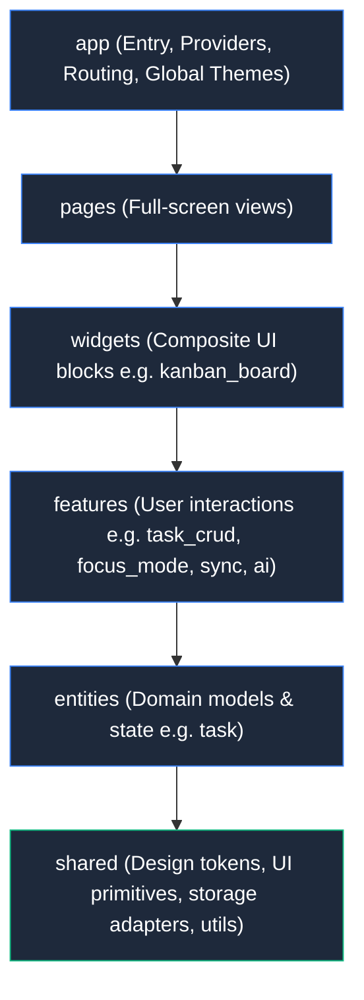
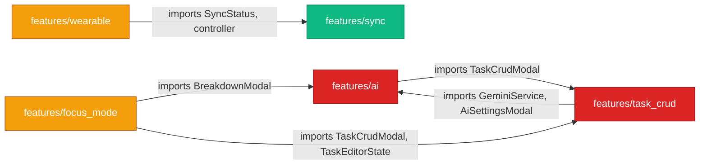

# Feature-Sliced Design (FSD) Architectural Specification & Audit

## 1. Executive Summary

This document establishes the official **Feature-Sliced Design (FSD v2.1)** architectural specification for **Pin** (a lightweight, local-first Kanban companion built for Linux, Android, Web, and Wear OS), catalogs all identified architectural breaches in the current codebase, and defines strict automated rules and a remediation roadmap to ensure long-term maintainability.

---

## 2. Core Architectural Principles of FSD in Pin

Feature-Sliced Design is an architectural methodology for frontend applications. It partitions a codebase into three hierarchical concepts: **Layers**, **Slices**, and **Segments**.



### 2.1 The Cardinal Rule of Direction (Unidirectional Imports)

> **Rule 1**: A file in a given layer may **ONLY** import code from layers **strictly below it**.
> A layer must NEVER import from layers above it or beside it.

$$\text{app} \succ \text{pages} \succ \text{widgets} \succ \text{features} \succ \text{entities} \succ \text{shared}$$

- `app` can import from all lower layers (`pages`, `widgets`, `features`, `entities`, `shared`).
- `pages` can import `widgets`, `features`, `entities`, `shared`. (**Cannot import `app`**).
- `widgets` can import `features`, `entities`, `shared`. (**Cannot import `app` or `pages`**).
- `features` can import `entities`, `shared`. (**Cannot import `app`, `pages`, or `widgets`**).
- `entities` can import `shared`. (**Cannot import `app`, `pages`, `widgets`, or `features`**).
- `shared` can import **nothing** from the application layers. It is strictly foundational.

### 2.2 Cross-Slice Isolation (Horizontal Boundaries)

> **Rule 2**: Slices residing on the same layer must **NEVER** import directly from one another.

- A feature slice (e.g., `features/task_crud`) must **never** import from another feature slice (e.g., `features/ai`).
- An entity slice (e.g., `entities/task`) must **never** import from another entity slice.
- Cross-feature interactions must be orchestrated **upwards** at the `widgets` or `pages` layer via composition, dependency injection, callbacks, or decoupled state providers.

### 2.3 Public API Encapsulation

> **Rule 3**: Every slice must expose its capabilities via a **public API barrel file** (`<slice>.dart` or `index.dart`).

- External consumers may only import from the slice's public API.
- Deep imports into internal segments (e.g., `import '../../sync/services/firestore_sync_service.dart'`) violate encapsulation and expose private implementation details.

---

## 3. Comprehensive Codebase Audit Findings

An automated AST scan of all 48 Dart files and 222 import statements across `lib/` identified several critical architectural violations:

### 3.1 Upward Layer Inversion (High Severity)

| Source File | Source Layer | Target File | Target Layer | Breach Type |
|---|---|---|---|---|
| `lib/shared/ui/pin_breakpoints.dart:2` | `shared` | `lib/features/wearable/wearable_utils.dart` | `features` | **Lower layer importing higher layer** |

- **Root Cause**: `WearableUtils` computes `MediaQuery.sizeOf(context).shortestSide <= 320.0` and circular padding. It contains no business logic or user interaction. Placing it inside `features/wearable` forced the foundational `shared/ui/pin_breakpoints.dart` to reach up into `features`.
- **Architectural Impact**: Creates a circular design flaw where infrastructure depends on user features.

---

### 3.2 Misplaced Layer Responsibilities (Medium Severity)

| File | Current Location | True Architectural Layer | Issue |
|---|---|---|---|
| `wearable_home_page.dart` (1,600 lines) | `lib/features/wearable/ui/` | `pages/wearable/` | Full-screen application view with Scaffolding, PageView, and navigation placed inside `features`. |
| `wearable_utils.dart` | `lib/features/wearable/` | `shared/lib/` or `shared/ui/` | Viewport and geometry utility placed in `features`. |

- **Root Cause**: `features/wearable` became a catch-all folder for the entire wearable platform implementation rather than a discrete user capability.
- **Architectural Impact**: `pages/home/home_page.dart` imports a "feature" (`wearable_home_page.dart`) to render its watch viewport, while that feature internally behaves like a page.

---

### 3.3 Cross-Slice Feature Coupling (High Severity)

Feature slices currently import each other directly, creating tight horizontal coupling and circular dependencies:



#### Detailed Cross-Slice Violations:

1. **Circular Coupling: `features/ai` $\longleftrightarrow$ `features/task_crud`**:
   - `lib/features/ai/ui/ai_task_breakdown_modal.dart:9` imports `../../task_crud/ui/task_crud_modal.dart`
   - `lib/features/task_crud/ui/task_crud_modal.dart:11-13` imports:
     - `../../ai/services/ai_config_service.dart`
     - `../../ai/services/gemini_service.dart`
     - `../../ai/ui/ai_settings_modal.dart`
   - *Impact*: Neither feature can be tested, refactored, or compiled independently. Changes to AI break task CRUD and vice versa.

2. **`features/focus_mode` Coupling**:
   - `lib/features/focus_mode/ui/focus_mode_view.dart:14-16` imports:
     - `../../ai/ui/ai_task_breakdown_modal.dart`
     - `../../task_crud/state/task_editor_state.dart`
     - `../../task_crud/ui/task_crud_modal.dart`
   - *Impact*: Focus mode cannot be isolated as a standalone distraction-free timer; it directly instantiates the full task creation and AI modals.

3. **`features/wearable` Coupling**:
   - `lib/features/wearable/ui/wearable_home_page.dart:8-9` imports:
     - `../../sync/model/sync_status.dart`
     - `../../sync/state/sync_controller.dart`
   - *Impact*: The wearable view directly manipulates cloud sync state rather than delegating through high-level providers or composite widgets.

---

### 3.4 Entity Aggregate Root Misalignment (Medium Severity)

| Source File | Target File | Issue |
|---|---|---|
| `lib/entities/task/state/task_state_notifier.dart:6` | `lib/entities/atomic_step/model/atomic_step.dart` | Cross-entity import |
| `lib/entities/task/model/pin_task.dart:1` | `lib/entities/atomic_step/model/atomic_step.dart` | Cross-entity import |

- **Root Cause**: `AtomicStep` (checklist item with title, status, and sort order) is modeled as an independent entity slice `entities/atomic_step`.
- **Domain-Driven Analysis**: An atomic step has no identity, persistence, or lifecycle independent of its parent `PinTask`. It is a value object / child entity belonging strictly to the `Task` Aggregate Root.
- **Architectural Impact**: Splitting it into its own top-level entity slice violates DDD aggregate boundaries and causes cross-entity coupling.

---

### 3.5 Total Absence of Public API Barrels (Low/Medium Severity)

- **Finding**: Zero slices in `lib/features`, `lib/entities`, `lib/widgets`, or `lib/shared` have barrel files (`index.dart` or `<slice>.dart`).
- **Impact**: All 222 import statements across the app perform deep imports into internal segments (`../../sync/services/firestore_sync_service.dart`). Internal refactoring immediately breaks external callers.

---

## 4. Remediation Architecture & Target State

### 4.1 Target Directory Layout

```
lib/
├── app/                              # Application initialization & configuration
│   ├── app.dart
│   ├── theme/
│   └── app.dart
├── pages/                            # Full-screen views
│   ├── home/
│   │   ├── home_page.dart
│   │   └── home.dart                 # Public API
│   └── wearable/
│       ├── wearable_home_page.dart   # Relocated from features/wearable
│       └── wearable_page.dart        # Public API
├── widgets/                          # Composite UI blocks
│   └── kanban_board/
│       ├── kanban_board.dart         # Public API
│       └── ui/
│           ├── task_card.dart
│           ├── kanban_column.dart
│           ├── layered_deck_view.dart
│           └── wide_fold_kanban_view.dart
├── features/                         # Independent user action slices
│   ├── ai/                           # AI breakdown & config
│   │   ├── ai.dart                   # Public API
│   │   ├── services/
│   │   └── ui/
│   ├── focus_mode/                   # Distraction-free stopwatch
│   │   ├── focus_mode.dart           # Public API
│   │   └── ui/
│   ├── sync/                         # Cloud & local synchronization
│   │   ├── sync.dart                 # Public API
│   │   ├── model/
│   │   ├── services/
│   │   ├── state/
│   │   └── ui/
│   ├── task_crud/                    # Task creation, editing, deletion
│   │   ├── task_crud.dart            # Public API
│   │   ├── state/
│   │   └── ui/
│   └── task_export_import/           # JSON/Blueprint backup & restore
│       ├── task_export_import.dart   # Public API
│       └── ui/
├── entities/                         # Business models & domain state
│   └── task/                         # Task aggregate root
│       ├── task.dart                 # Public API
│       ├── model/
│       │   ├── pin_task.dart
│       │   └── atomic_step.dart      # Consolidated into Task aggregate
│       ├── state/
│       └── ui/
└── shared/                           # Primitives, tokens, infrastructure
    ├── shared.dart                   # Public API
    ├── api/storage/
    ├── lib/
    │   ├── date_helpers.dart
    │   ├── blueprint_codec.dart
    │   └── wearable_utils.dart       # Relocated from features/wearable
    └── ui/
        ├── pin_breakpoints.dart
        ├── pin_tokens.dart
        ├── pin_button.dart
        └── wip_badge.dart
```

### 4.2 Decoupling Strategies for Cross-Feature Dependencies

To eliminate horizontal feature coupling without losing existing capabilities:

1. **`ai` $\longleftrightarrow$ `task_crud` Decoupling**:
   - Instead of `TaskCrudModal` directly constructing `AiSettingsModal` and `GeminiService`:
     - Provide an optional `WidgetBuilder? trailingActionBuilder` or callback `VoidCallback? onAiBreakdownRequested`.
     - In `widgets/kanban_board` or `pages/home`, compose the two: pass the AI breakdown trigger into the task editor modal.
   - For `AiTaskBreakdownModal` calling `TaskCrudModal`:
     - Pass an `onOpenEditor: void Function(PinTask task)` callback from the caller (`HomePage`), completely removing the import of `task_crud` from `ai`.

2. **`focus_mode` Decoupling**:
   - `FocusModeView` should accept callbacks:
     ```dart
     final void Function(PinTask task)? onEditTask;
     final void Function(PinTask task)? onBreakdownTask;
     ```
   - `HomePage` or `kanban_board` provides the concrete modals upon invocation.

3. **`wearable_home_page` Relocation**:
   - Move `WearableHomePage` to `lib/pages/wearable/wearable_home_page.dart`.
   - As a page, it is legally permitted in FSD to import `features/sync`, `entities/task`, and `widgets`.

---

## 5. Automated Architectural Enforcement & Linting

Because the default Dart analyzer cannot inspect directory paths for layer boundaries, we introduce automated enforcement at two complementary levels:

### 5.1 Static Analysis Configuration (`analysis_options.yaml`)

We enable strict type safety, import consistency, and unused import pruning:

```yaml
analyzer:
  language:
    strict-casts: true
    strict-inference: true
    strict-raw-types: true

linter:
  rules:
    - avoid_relative_lib_imports
    - directives_ordering
    - prefer_relative_imports
    - unnecessary_import
    - cancel_subscriptions
    - close_sinks
```

### 5.2 Automated Architecture Test (`test/architecture/fsd_architecture_test.dart`)

An automated test executed with `flutter test` that parses the AST of every `.dart` file in `lib/`:
1. **Verifies Layer Hierarchy**: Fails immediately if any file in `shared` imports from `entities`, `features`, `widgets`, `pages`, or `app`, etc.
2. **Verifies Cross-Slice Isolation**: Fails immediately if a new feature imports another feature (with an explicit known-baseline tracker for phased migration).
3. **Guards Against Regressions**: Any newly introduced import violating FSD boundaries causes the build/CI to fail with clear diagnostic output.

### 5.3 CLI Diagnostic Tool (`tool/verify_fsd.dart`)

A standalone Dart CLI script runnable via `dart run tool/verify_fsd.dart`:
- Reports total breaches categorized by severity.
- Outputs exact line numbers, offending import targets, and remediation advice.
- Provides exit code `0` on clean architecture and `1` on regression.

---

## 6. Phased Migration Roadmap

| Phase | Description | Status |
|---|---|---|
| **Phase 1** | Audit codebase, generate architecture documentation, implement strict `analysis_options.yaml`, and add automated test & CLI tool. | **Completed** |
| **Phase 2** | Relocate `WearableUtils` to `shared/ui/` to eliminate upward layer inversion. | **Completed** |
| **Phase 3** | Consolidate `AtomicStep` into `entities/task/` Aggregate Root, eliminating `entities/atomic_step` cross-slice coupling. | **Completed** |
| **Phase 4** | Relocate `WearableHomePage` to `pages/home/` as the watch-tier view of the Home page, removing `features/wearable`. | **Completed** |
| **Phase 5** | Decouple `ai`, `task_crud`, and `focus_mode` via app-layer handlers and widget/page composition callbacks. Zero circular dependencies. | **Completed** |
| **Phase 6** | Public API barrel exports across all slices. | Planned |

**Current Status**: 0 Upward Inversions, 0 Cross-Slice Couplings, 100% strict compliance in `tool/verify_fsd.dart --strict` and `fsd_architecture_test.dart`.
